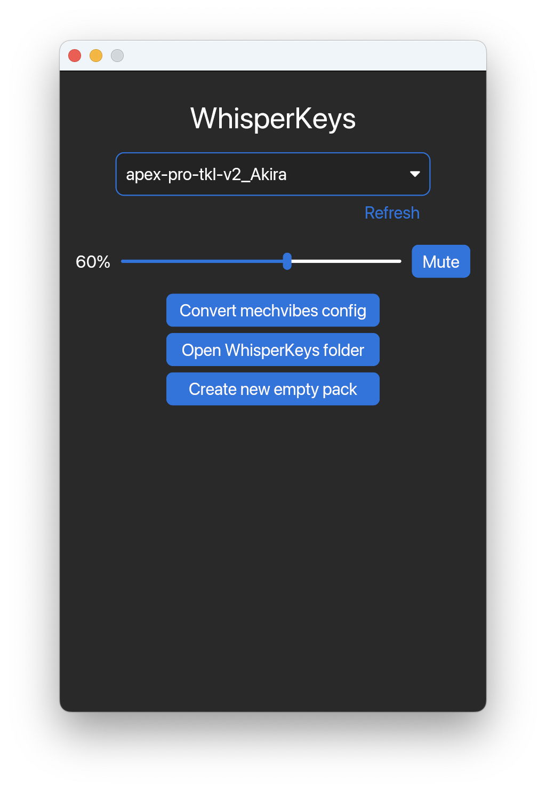

# WhisperKeys
**Mechanical keyboard sound reproduction**

WhisperKeys is a Rust-based tool that plays mechanical keyboard sounds as you type.
Built with performance in mind, it delivers responsive audio feedback to enhance your typing experience, without unnecessary delay.

## Features

- Responsive playback with low-latency sounds that keep up with your typing.
- Compatible with Mechvibes v1 configurations.
- Pitch and volume variation for a more natural feel.
- Easily generate your own sound packs.

## Screenshots

## Tray icon state
A tray icon–only mode is planned, but currently not available as it depends on a feature from the framework. [iced-rs issue #124](https://github.com/iced-rs/iced/issues/124).
## Versioning 

This project uses a **Year.Month.Release** format, with an optional `!` suffix to indicate breaking changes.

**Format:**

`YYYY.M.R[!]`
- YYYY – 4-digit year of release
- M – month of release (no leading zero)
- R – release number within that month (starting at 1)
- ! – appended if the release introduces breaking changes
Examples:
- 2025.8.1 → First release of August 2025
- 2025.8.2 → Second release of August 2025
- 2025.8.3! → Third release of August 2025, introduces breaking changes

Breaking changes are described in detail in the CHANGELOG.
## Acknowledgements

 - [Mechvibes](https://mechvibes.com)

## License

[GNU GPL v3.0](https://choosealicense.com/licenses/gpl-3.0/#)

